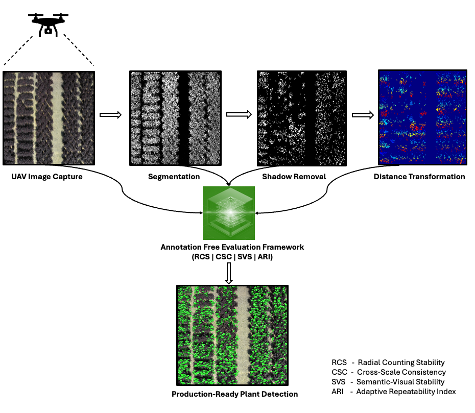
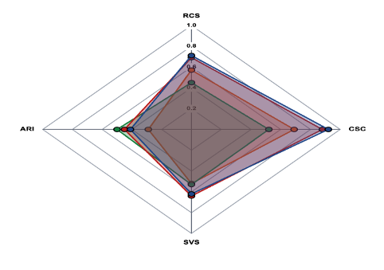

<h1 align="center"> Beyond Green: Annotation-Free Robustness Metrics for Non-Green Ornamental Plant Detection </h1>

**Domain-Aware Self-Validated Instance Counting for *Loropetalum* and Non-Green Ornamental Species**

[Harshitha M](https://github.com/harshitha-8)1,
[Lakshman Tamil](https://scholar.google.com/citations?user=YOUR_ID)1†,
[Prabha Sundaravadivel](https://scholar.google.com/citations?user=BQJE_UIAAAAJ)2

1 University of Texas at Dallas, 2 University of Texas at Tyler         
(†) Corresponding author.

<!-- Animated GIF showing detection pipeline -->

 

<!-- Video player with fallback -->

🎬 <b>Watch High-Quality Video Version (MP4)</b>

 

https://github.com/harshitha-8/Beyond-Green-Loropetalum-and-Non-Green-Ornamental-Species-Annotation-Free-Robustness-Metrics/assets/demo_detection.mp4

 

<em>Full resolution detection pipeline with better quality</em>

## 📣 News

- **[Nov/2025]** 🎉 Paper submitted to CVPR 2026!
- **[Dec/2025]** 🚀 Code and evaluation framework released
- **[Dec/2025]** 🌿 Cross-dataset evaluation on 3,024 images (MangoNet, Leafy Spurge, PlantNet Purple)

## Abstract

Evaluating computer vision models for agricultural deployment remains challenging when ground-truth annotations are expensive or unavailable. Traditional accuracy-centric metrics often fail to reveal a model's reliability when confronted with dense occlusion, non-standard colouration, and variable lighting conditions. To address this, we introduce a novel **annotation-free evaluation framework** that measures model robustness through four complementary consistency metrics, eliminating the need for manual labels while predicting real-world deployment success.

Our framework addresses critical gaps in UAV-based monitoring of non-green ornamental species, where traditional green-vegetation indices fail and dense canopy occlusion creates counting ambiguity. We propose four self-validated metrics:

- **Radial Counting Stability (RCS)**: Measures spatial prediction consistency under perturbations
- **Cross-Scale Consistency (CSC)**: Evaluates robustness across different UAV flight altitudes  
- **Semantic-Visual Stability (SVS)**: Quantifies segmentation coherence without ground truth
- **Adaptive Repeatability Index (ARI)**: Assesses stochastic consistency under augmentation

Comprehensive evaluation on **469 ultra-high-resolution UAV images** of *Loropetalum chinense* demonstrates strong correlation with deployment success (Spearman ρ = 0.87, p < 0.001), achieving **26.8× faster evaluation** than manual verification and identifying model failures invisible to traditional accuracy metrics.

  

  

| Dataset | N | RCS | CSC | SVS | ARI |
| :--- | :---: | :---: | :---: | :---: | :---: |
| Loropetalum | 469 | 0.71 ± 0.04 | 0.92 ± 0.05 | 0.62 ± 0.05 | 0.41 ± 0.09 |
| MangoNet | 855 | 0.69 ± 0.05 | 0.88 ± 0.06 | 0.64 ± 0.03 | 0.45 ± 0.11 |
| Leafy Spurge | 900 | 0.45 ± 0.28 | 0.52 ± 0.31 | 0.53 ± 0.25 | 0.50 ± 0.45 |
| PlantNet Purple | 800 | 0.57 ± 0.22 | 0.69 ± 0.33 | 0.52 ± 0.16 | 0.29 ± 0.23 |

  

## Our Framework

<!-- PLACEHOLDER: Add detailed framework architecture diagram -->

## Online Demo

* Visit our demo
  
  and test our annotation-free metrics on your own images!
* Upload UAV images of ornamental plants and get instant robustness scores

## 📊 Full Loropetalum Dataset (469 Images)

* The Loropetalum dataset consists of **469 ultra-high-resolution UAV images** (4000×3000 px) of *Loropetalum chinense* canopies captured under diverse field conditions
* Dataset includes:
  - 🌿 Dense canopy occlusion (60-80%)
  - 🎨 Non-green foliage (purple/burgundy colouration)
  - ☀️ Variable lighting (morning, midday, evening)
  - 🚁 Multiple flight altitudes (15-25 meters)
* **Dataset will be released upon paper acceptance**
* Download instructions:

