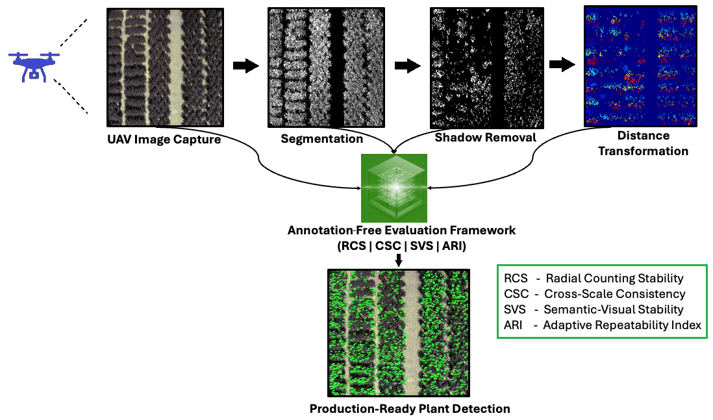
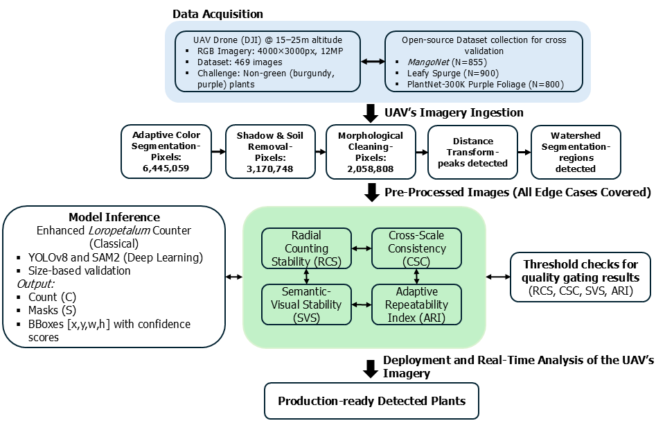
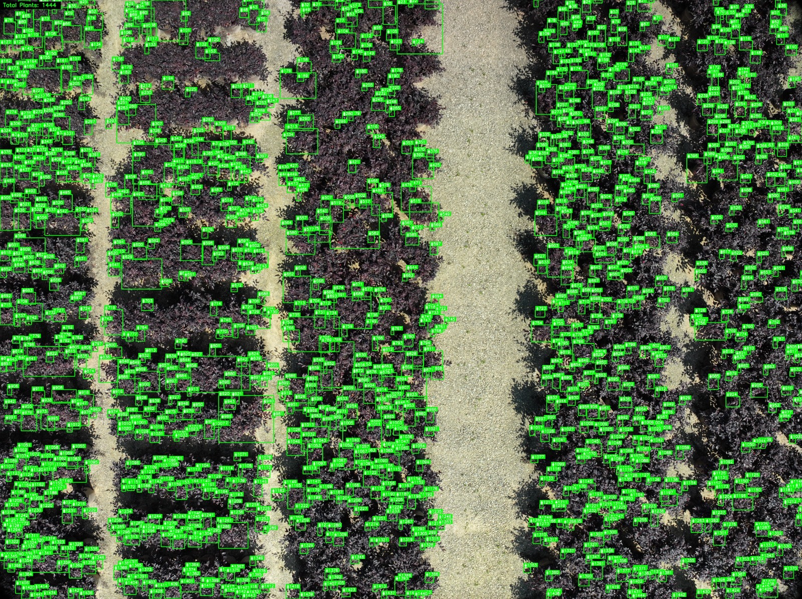
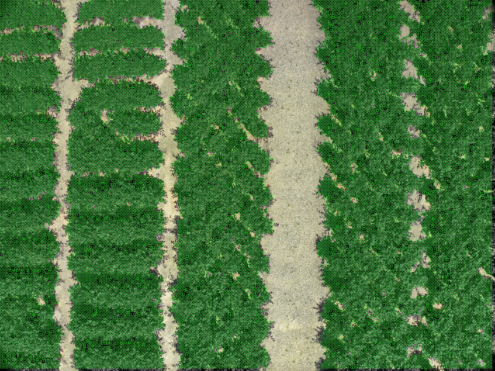
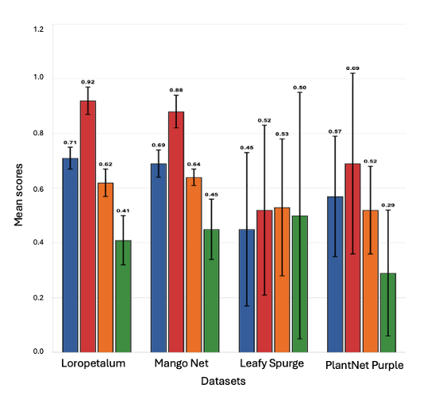
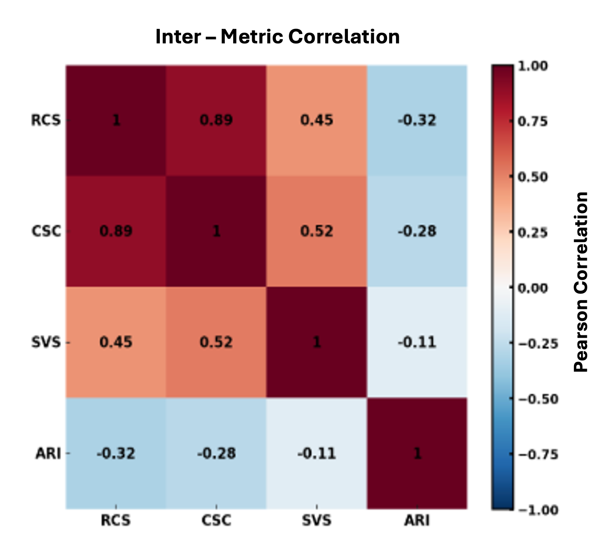
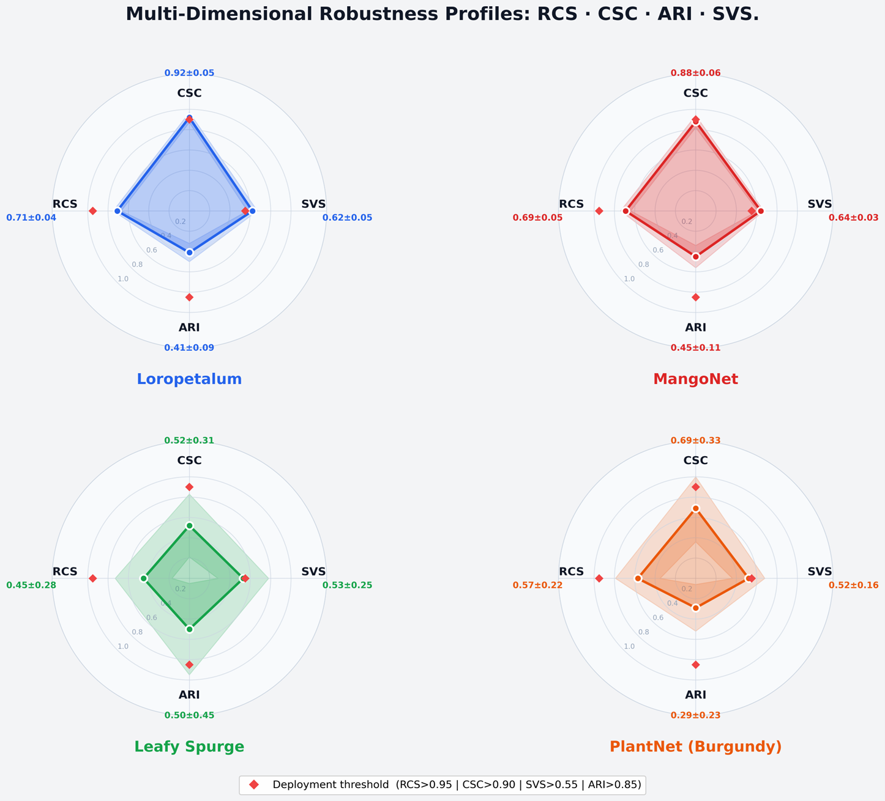
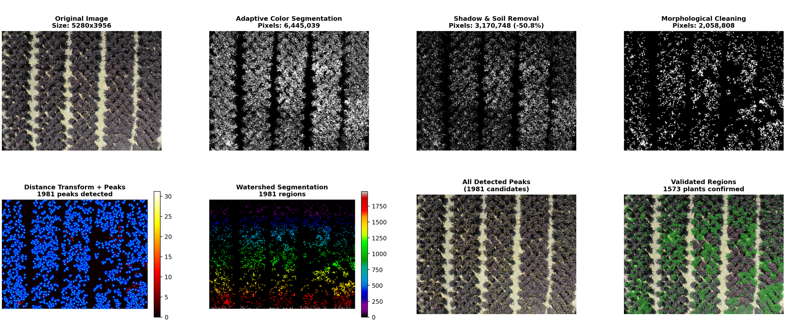

<h1 align="center">Beyond Green: Domain-Aware Self-Validated Instance Counting for Loropetalum and Non-Green Ornamental Species using Annotation-Free Robustness Metrics</h1>

<p align="center"><b>Accepted Poster - CVPR 2026 Workshop V4A (Agriculture Vision 2026)</b></p>

<p align="center">
  <a href="https://openreview.net/forum?id=SD6FZaEJAH"></a>
  <a href="https://openreview.net/group?id=thecvf.com/CVPR/2026/Workshop/V4A&referrer=%5BHomepage%5D(%2F)#tab-accept-poster"></a>
  <a href="https://www.agriculture-vision.com/agriculture-vision-2026"></a>
  <a href="https://htmlpreview.github.io/?https://github.com/harshitha-8/Beyond-Green-Loropetalum-and-Non-Green-Ornamental-Species-Annotation-Free-Robustness-Metrics/blob/main/web/cvpr_demo_showcase.html"></a>
  <a href="https://opensource.org/licenses/MIT"></a>
</p>

<p align="center">
Harshitha Manjunatha<sup>1</sup>, Prabha Sundaravadivel<sup>2*</sup>, Shekhar Suman Borah<sup>2</sup>, Lakshman Tamil<sup>1</sup>, Patricia R. Knight<sup>3</sup>, H. Allen Torbert<sup>4</sup>, Siva P. Kumpatla<sup>4</sup><br>
<sup>1</sup>The University of Texas at Dallas, USA | <sup>2</sup>The University of Texas at Tyler, USA | <sup>3</sup>Mississippi State University, USA | <sup>4</sup>USDA Agricultural Research Service (ARS), USA<br>
<sup>*</sup>Corresponding author: psundaravadivel@uttyler.edu
</p>

This repository is aligned to the camera-ready version of the accepted CVPR 2026 V4A workshop paper.

## Abstract

Counting and segmenting dense plants in UAV imagery is difficult under occlusion, color variation, and lighting changes. This work introduces an annotation-free robustness evaluation framework with four complementary metrics:

- `RCS` (Radial Counting Stability)
- `CSC` (Cross-Scale Consistency)
- `SVS` (Semantic-Visual Stability)
- `ARI` (Adaptive Repeatability Index)

On 469 high-resolution *Loropetalum chinense* UAV images (average ~1,398 plants/frame, max 1,789), the framework shows strong correlation with deployment success (`rho = 0.87`, `p < 0.001`) and reduces validation time by about `15x` compared to full manual annotation (`190-380 min/image`). Within the metric pipeline, CLIP-based stratified sampling provides about `35x` computational speedup.

## Why This Work Matters

- Moves beyond single-number accuracy by measuring robustness under spatial, scale, semantic, and stochastic variations.
- Targets hard real-world conditions: dense canopies, non-green foliage, shadow noise, and severe occlusion.
- Connects research metrics to deployment outcomes: when all four thresholds pass, observed failure rate drops substantially.

## For Collaborators

I am **Harshitha Manjunatha**, and this project represents how I approach computer vision work end-to-end:

- Problem framing from field constraints, not only benchmark assumptions.
- Method design with interpretable, deployment-oriented metrics.
- Practical tooling with reproducible scripts, visual diagnostics, and documentation.

If you want to collaborate on UAV and remote-sensing robustness, I would be glad to connect.

- Direct contact: `Harshitha.Manjunatha@UTDallas.edu`
- Project issues/discussions: this repository

## Highlights from the CVPR Paper

- Dataset scale: `469` UAV images (`4000x3000`) with dense canopies and `60-80%` occlusion.
- Baseline counting model (test set): `MAE = 23.7 +/- 8.2`, `RMSE = 31.4`, relative error `1.85%` (mean count `1,412`).
- Production thresholds recommended by the paper:
  - `RCS > 0.95`
  - `CSC > 0.90`
  - `SVS > 0.55`
  - `ARI > 0.85`

## Demo

<p align="center">
  
</p>

Primary demo outputs:

- `results/cvpr_demo/cvpr_demo.mp4`
- `results/cvpr_demo/index.html`
- `results/cvpr_demo/storyboard.md`

Rebuild demo assets:

```bash
python scripts/generate_hd_demo_stage_assets.py
python scripts/build_cvpr_demo.py --manifest cvpr_demo_manifest.json --output-dir results/cvpr_demo
```

## Reported Results

### Table 1: Aggregate Robustness Statistics on 469 Images

| Metric | Mean | Std | Min | Max | Production Threshold |
| :--- | ---: | ---: | ---: | ---: | :--- |
| RCS | 0.981 | 0.015 | 0.958 | 0.998 | > 0.95 |
| CSC | 0.932 | 0.038 | 0.770 | 0.993 | > 0.90 |
| SVS | 0.598 | 0.024 | 0.557 | 0.634 | > 0.55 |
| ARI | 0.919 | 0.087 | 0.685 | 0.994 | > 0.85 |

### Table 2: Cross-Dataset Robustness (Min-Max Normalized)

| Dataset | N | RCS | CSC | SVS | ARI |
| :--- | ---: | ---: | ---: | ---: | ---: |
| Loropetalum | 469 | 0.71 +/- 0.04 | 0.92 +/- 0.05 | 0.62 +/- 0.05 | 0.41 +/- 0.09 |
| MangoNet | 855 | 0.69 +/- 0.05 | 0.88 +/- 0.06 | 0.64 +/- 0.03 | 0.45 +/- 0.11 |
| Leafy Spurge | 900 | 0.45 +/- 0.28 | 0.52 +/- 0.31 | 0.53 +/- 0.25 | 0.50 +/- 0.45 |
| PlantNet Purple | 800 | 0.57 +/- 0.22 | 0.69 +/- 0.33 | 0.52 +/- 0.16 | 0.29 +/- 0.23 |

Note: Table 1 uses absolute aggregate statistics on the Loropetalum benchmark, while Table 2 is min-max normalized for cross-dataset comparison and is not directly comparable to Table 1.

## Paper Figure Gallery

All images below were extracted from the camera-ready PDF and optimized for repository viewing.

### Figure 1: Self-Validated Counting Pipeline



### Figure 2: Domain-Aware Architecture



### Figure 3 and Figure 4: Real UAV Field Conditions




### Figure 5: Cross-Dataset Robustness Profiles



### Figure 6 and Figure 7: Metric Relationships and Robustness Signatures




### Figure 8: Sequential Detection Workflow



## Installation

```bash
python -m venv .venv
source .venv/bin/activate
pip install -r requirements.txt
pip install -e .
```

## Quick Start

### 1) Run the CVPR Pipeline

```bash
python experiments/cvpr_optimized_processing.py \
  --input path/to/image_or_dataset \
  --output results/cvpr_pipeline
```

### 2) Generate Annotation-Free Metrics

```bash
python experiments/loropetalum_metrics_generation.py \
  --data-dir path/to/loropetalum_dataset \
  --output results/loropetalum_metrics
```

### 3) Evaluate Strategy Variants

```bash
python experiments/strategy_evaluation.py \
  --data-dir path/to/loropetalum_dataset \
  --output results/strategy_evaluation
```

### 4) Compare Classical vs YOLOv8

```bash
python experiments/classical_vs_yolov8_comparison.py \
  --data-dir path/to/loropetalum_dataset \
  --output results/classical_vs_yolov8
```

## Repository Layout

```text
.
|- assets/                  # figures, demo stages, media
|- configs/                 # experiment config (paper thresholds included)
|- experiments/             # experiment entry points
|- scripts/                 # demo and utility scripts
|- src/                     # metrics, models, preprocessing, utils
|- cvpr_demo_manifest.json  # storyboard manifest
`- results/cvpr_demo/       # generated demo package
```

## Camera-Ready Checklist

See [`docs/CAMERA_READY_CHECKLIST.md`](docs/CAMERA_READY_CHECKLIST.md) for the release checklist used for this repository.
Canonical paper metadata and benchmark values are summarized in [`docs/PAPER_ALIGNMENT.md`](docs/PAPER_ALIGNMENT.md).

## Citation

Machine-readable citation metadata is provided in [`CITATION.cff`](CITATION.cff).

```bibtex
@inproceedings{manjunatha2026beyondgreen,
  title     = {Beyond Green: Domain-Aware Self-Validated Instance Counting for Loropetalum and Non-Green Ornamental Species using Annotation-Free Robustness Metrics},
  author    = {Manjunatha, Harshitha and Sundaravadivel, Prabha and Borah, Shekhar Suman and Tamil, Lakshman and Knight, Patricia R. and Torbert, H. Allen and Kumpatla, Siva P.},
  booktitle = {CVPR 2026 Workshops (V4A)},
  year      = {2026},
  note      = {Accepted poster},
  url       = {https://openreview.net/forum?id=SD6FZaEJAH}
}
```

## License

This project is released under the MIT License. See [`LICENSE`](LICENSE) for details.
