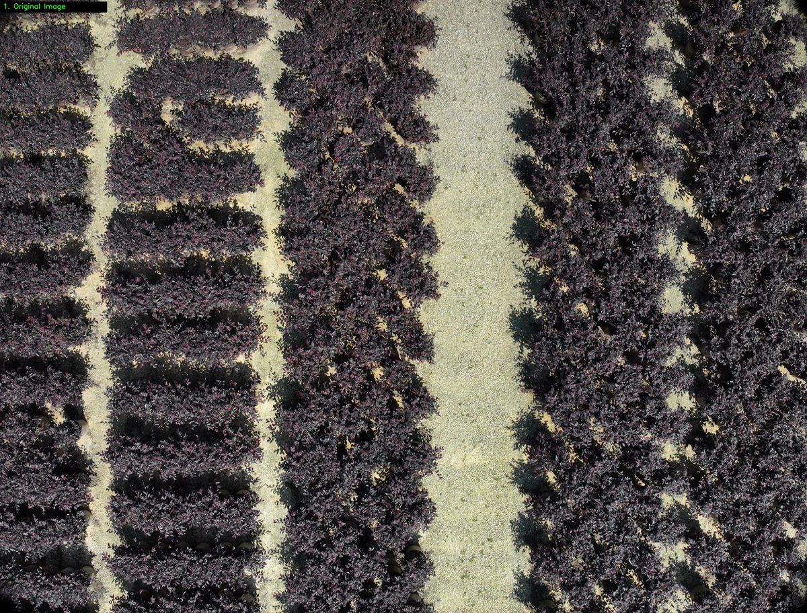
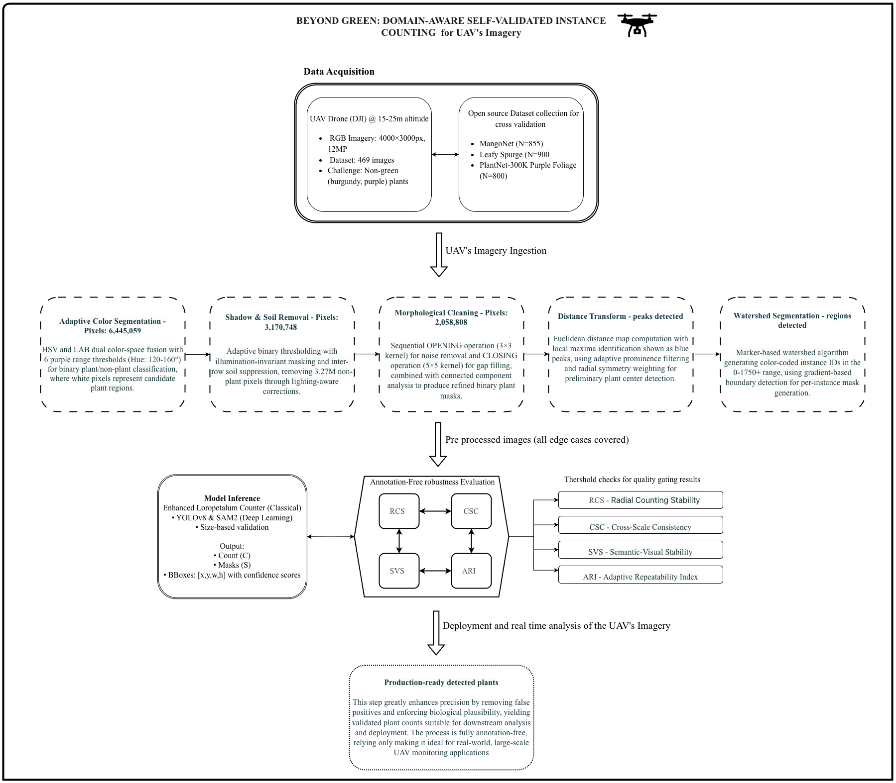
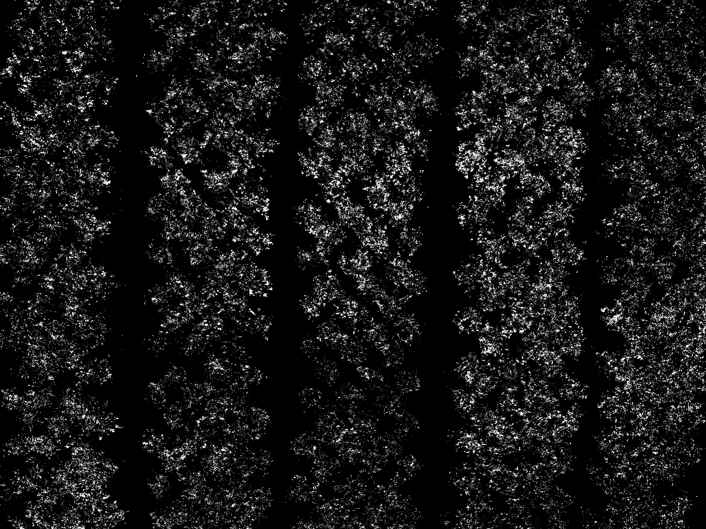
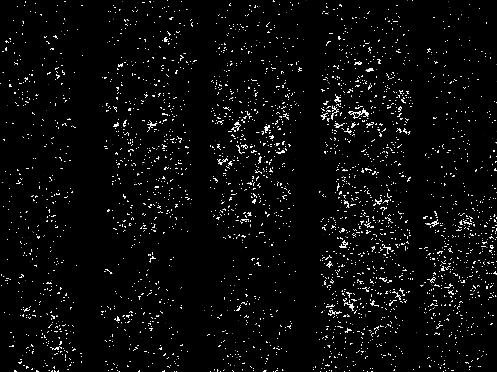
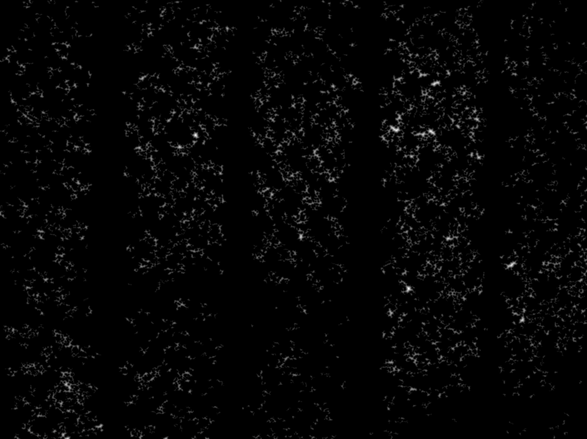
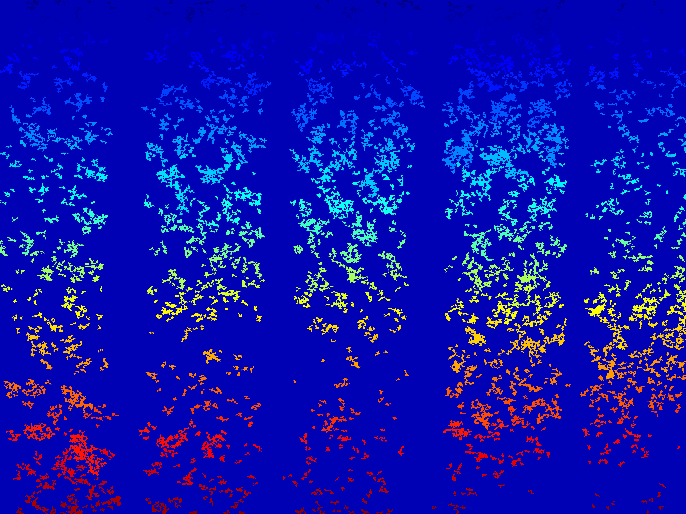
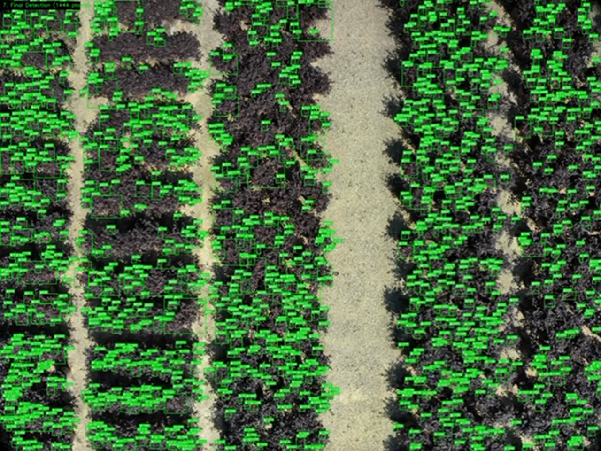

# Beyond Green Ornamental Plant Robustness Metrics Demo

This storyboard keeps the first three presentation slides and then follows the five high-resolution processing stages used for the ornamental plant detection demo from frame 4 onward.

## Slide 1: Beyond Green: Annotation-Free Robustness Metrics for Non-Green Ornamental Plant Detection

## Slide 2: Detection Pipeline Demo Frame

Opening frame from the original project demo video, showing the UAV perspective over burgundy Loropetalum rows before the downstream detection and robustness analysis stages are presented.

## Slide 3: Annotation-Free Robustness Framework

System overview covering UAV image acquisition, adaptive color segmentation, shadow and soil removal, morphological cleanup, watershed-based instance grouping, and the annotation-free evaluation metrics RCS, CSC, SVS, and ARI.

## Slide 4: Color Segmentation

High-resolution binary canopy segmentation showing the first dense extraction of burgundy ornamental plant regions from the UAV scene.

## Slide 5: Morphological Cleaning

High-resolution cleaned mask after the structural filtering stage removes small fragments and preserves the plant instances used in later counting.

## Slide 6: Distance Transform

High-resolution distance-transform response emphasizing the instance centers inside the cleaned ornamental canopy regions.

## Slide 7: Final Labels

High-resolution connected-label map showing the instance-separated plant regions retained for the final counting result.

## Slide 8: Final Detection

High-resolution final detection overlay using the provided Total Plants: 1444 frame, showing the complete box-based count over the ornamental rows.
