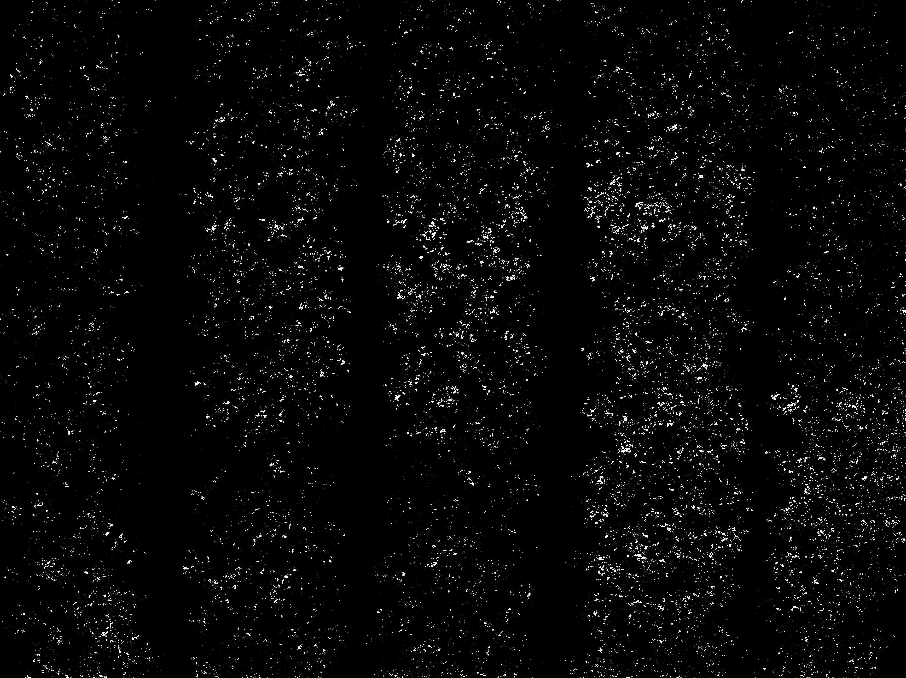

# CVPR Demo: Beyond Green Ornamental Plant Robustness Metrics

This storyboard reformats the ornamental-plant detection project into the same high-resolution CVPR-style demo standard used in the Quantum-Feature-Selection repository, while following the step-by-step stage ordering shown in the original Demonstration_video.mp4 after the first three slides.

## Slide 1: Beyond Green: Annotation-Free Robustness Metrics for Non-Green Ornamental Plant Detection

## Slide 2: Detection Pipeline Demo Frame

Opening frame from the original project demo video, showing the UAV perspective over burgundy Loropetalum rows before the downstream detection and robustness analysis stages are presented.

## Slide 3: Annotation-Free Robustness Framework

System overview covering UAV image acquisition, adaptive color segmentation, shadow and soil removal, morphological cleanup, watershed-based instance grouping, and the annotation-free evaluation metrics RCS, CSC, SVS, and ARI.

## Slide 4: Color Segmentation

High-resolution stage view showing the initial color-based canopy segmentation used to separate non-green ornamental plant regions from the background before downstream filtering.

## Slide 5: Shadow Removal

High-resolution shadow-suppressed response that removes darker nuisance structure while preserving the plant-related signal used for stable downstream counting.

## Slide 6: Morphological Cleaning

High-resolution morphological cleanup stage that removes fragmented noise and keeps the more meaningful candidate regions aligned with the ornamental canopy structure.

## Slide 7: Distance Transform

High-resolution distance-transform response emphasizing compact local maxima that can seed instance-aware grouping across dense ornamental rows.

## Slide 8: Final Labels

High-resolution connected-label visualization showing the grouped plant regions after the successive filtering and instance-generation steps.

## Slide 9: Final Detection

High-resolution final detection overlay showing the bounding-box result after the full pipeline has finished the ornamental plant counting process.
